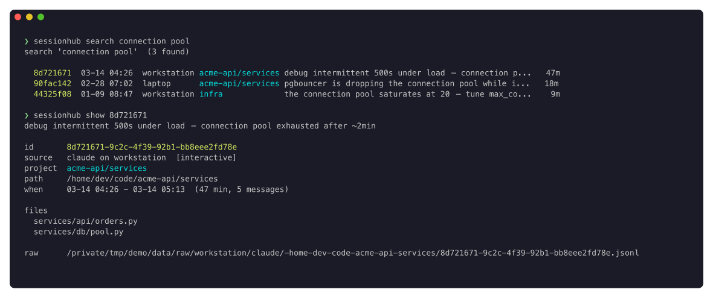
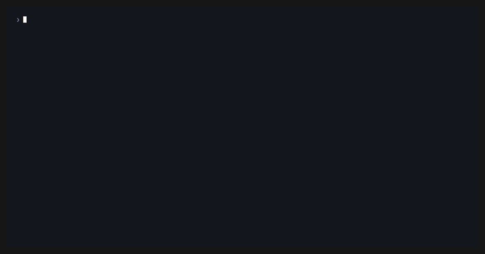
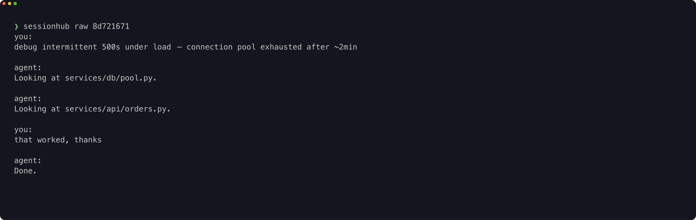

# sessionhub

Search everything you've ever done with your coding agents.





## Install

```bash
uv tool install git+https://github.com/esc5221/sessionhub
sessionhub setup
```

<sub>No uv? `curl -LsSf https://astral.sh/uv/install.sh | sh`. Python 3.11+.</sub>

`setup` finds your sessions, reads them in, and keeps them up to date on a
timer. It also asks what this machine is for: if you work on more than one,
one machine keeps the archive and the others query it over ssh.

## Use

```bash
sessionhub recent -d 3                 # last 3 days
sessionhub search "split brain"        # full text, across everything
sessionhub search --file src/auth.py   # sessions that touched a file
sessionhub list -p acme-api            # one project
sessionhub show 2c24cdad               # detail — 8 characters of the id is enough
sessionhub raw 2c24cdad                # the original transcript
```

Subagent and exec sessions are hidden by default; `-a` includes them.

Claude Code gets a skill during setup, so you can also just ask:

> *find the session where we fixed the pgbouncer timeout*

## How it works

A raw agent transcript is ~99.7% machinery — tool calls, streaming frames,
token accounting. sessionhub doesn't haul that around. It keeps three layers,
and only the small ones:

```
MIRROR   the original logs, left where the agent wrote them
   │       ~/.claude/projects · ~/.codex/sessions  — sessionhub never copies them
   ▼
DIGEST   the conversation, trimmed to what was actually said and gzipped
   │       remote machines send only this, over ssh — kilobytes, not gigabytes
   ▼
INDEX    one small row per session: title, project, files, full-text search
           plus a pointer back to where the full log lives
```

`sessionhub search`/`recent`/`list` read the INDEX. `sessionhub raw` prints the
DIGEST — the conversation, and only the conversation:



`sessionhub raw --full` opens the untrimmed log from the MIRROR — locally, or
over ssh on the machine that has it. The whole archive is one SQLite file —
hundreds of MB for thousands of sessions, not the tens of gigabytes the raw
logs occupy.

## Details

<details>
<summary>Working across more than one machine</summary>

Sessions live on whichever machine you were typing on, so pick **one** to keep
the archive — a desktop that's usually on is ideal. `sessionhub setup` asks
which role a machine has:

```
keeps the archive      reads its own sessions on a timer, and can pull in
                       other machines' sessions over ssh

queries the archive    stays empty; sends every search to the machine that
                       has one
```

On a laptop, choose *queries the archive* and give it the other machine's ssh
alias. Searches then run there and you get the results — nothing is copied.

```bash
sessionhub search "..."       # answered by the archive machine
sessionhub --local recent     # this machine's own data instead
```

The archive pulls a remote machine's sessions by asking it, over ssh, for
digests only — never the raw logs, which stay put. Read-only queries are
forwarded the same way; `ingest`, `run`, `service` and `uninstall` always act
locally, so they can't disturb a remote archive by accident.

```bash
sessionhub remote install     # writes a short `shm` alias for querying
```
</details>

<details>
<summary>Storage — why it stays small</summary>

Measured across a real archive, only **0.3%** of a raw transcript's bytes are
the conversation; the rest is tool-call and streaming machinery. sessionhub
keeps that 0.3% (compressed) plus a search index, and leaves the originals
where the agent wrote them. Thousands of sessions come to a few hundred MB —
vs. the tens of gigabytes the raw logs would take.

Two settings tune it, in `~/.config/sessionhub/config.toml`:

```toml
[digest]
mode = "conversation"   # what `sessionhub raw` shows and stores:
                        #   conversation  what was said (default)
                        #   full          the above + a line per tool action
                        #   none          no digest — index only, smallest
```

The cut lengths, file-detection, and what counts as a session aren't settings —
they're index quality, not preference. `raw --full` always reaches the complete
original in place, so nothing is truly discarded.

**Upgrading from an old install** that mirrored raw logs? One command builds the
digests and tells you which directory you can then delete:

```bash
sessionhub compact
```
</details>

<details>
<summary>The Claude Code skill</summary>

`sessionhub setup` installs it. To install it the way you install any other
skill, pick whichever fits:

```bash
# as a plugin, managed by Claude Code
/plugin marketplace add esc5221/sessionhub
/plugin install sessionhub@sessionhub

# or by hand, for yourself
sessionhub skill install                     # → ~/.claude/skills/sessionhub/

# or for one project, checked into its repo
cp -r plugins/sessionhub/skills/sessionhub .claude/skills/
```

Claude Code picks up a new skill straight away — no restart.
</details>

<details>
<summary>How projects are decided</summary>

Guessed from the directory you were working in. Container directories
(`code`, `work`, `repos`, `src`, …) are skipped in favour of the one that
names the project:

```
~/code/acme-api/services   →   acme-api / services
```

Keep repos somewhere unusual, or want a different answer? Add to
`~/.config/sessionhub/config.toml`:

```toml
[classification]
generic_components = ["sandbox"]     # more container dirs to skip
rules = [
  { pattern = "%/acme-monorepo%web%", project = "acme", subsystem = "web", priority = 10 },
  { pattern = "%/acme-monorepo%",     project = "acme" },
]
```

Highest priority wins. Rules you delete here are deleted from the database on
the next refresh.
</details>

<details>
<summary>Commands and configuration</summary>

```
setup                 guided first-run setup
recent list search    find sessions
show                  session detail (title, files, tags)
raw [--full]          the conversation digest; --full for the untrimmed log
stats status          totals · last refresh and errors
run                   refresh now (reads local, pulls remote digests over ssh)
compact               build digests from a legacy raw mirror, then free it
add-host <alias>      pull another machine's sessions INTO this archive
remote set <host>     send this machine's queries OUT to an archive elsewhere
remote install        write a short `shm` alias for the above
skill install         (re)install the Claude Code skill
service               install/uninstall the refresh timer
init                  create config non-interactively (setup does this for you)
uninstall [--purge]   remove the timer, optionally config and data
```

Setup installs a timer (launchd or systemd) that refreshes every 15 minutes.
`sessionhub run` refreshes now; `sessionhub status` shows the last refresh and
anything that failed to parse. A session in progress isn't fully on disk yet,
so the most recent minutes of work may be missing.

Everything lives in `~/.config/sessionhub/config.toml` and
`~/.local/share/sessionhub/`. `$SESSIONHUB_CONFIG_DIR`, `$SESSIONHUB_DATA_DIR`
and the usual `$XDG_*` variables move them.

```toml
[data]
db_path = "~/.local/share/sessionhub/hub.db"
raw_dir = "~/.local/share/sessionhub/raw"   # only a legacy mirror to `compact` from

[schedule]
interval_minutes = 15

[digest]
mode = "conversation"                  # conversation | full | none

[sources.local]
label = "laptop"                       # name shown in results; default: hostname
claude = "~/.claude/projects"
codex_sessions = "~/.codex/sessions"
codex_state = "~/.codex/state_5.sqlite"

[[sources.remote]]                     # machines this archive pulls from
name = "workstation"
host = "workstation"                   # ssh alias
label = "workstation"

[remote_query]                         # the archive this machine queries
host = "workstation"
bin = "/abs/path/to/sessionhub"        # setup fills this in
```

`bin` exists because a non-interactive ssh shell has a minimal PATH that often
omits `~/.local/bin`. Setup detects the absolute path so you don't have to.
</details>

<details>
<summary>Update and uninstall</summary>

```bash
uv tool upgrade sessionhub       # pulls the latest commit

sessionhub uninstall --purge     # timer, config and database
uv tool uninstall sessionhub
```
</details>

## Agents

Reading an agent's history means parsing whatever it writes to disk, so support
is per-agent:

```
Claude Code    ~/.claude/projects/*.jsonl
Codex          ~/.codex/sessions/**.jsonl  (+ the state sqlite, when present)
```

Want another one — Cursor, Aider, Gemini CLI, something in-house? Open an issue
with a sample transcript, or send a pull request. An adapter is one file in
`src/sessionhub/adapters/`: iterate the files, return a `ParsedSession` per
session. Nothing else in the pipeline needs to know the format.

## Development

```bash
uv run --extra dev pytest -q
uv run --extra dev ruff check .
```

The screenshots come from a generated demo archive, so they can be rebuilt and
contain nobody's real transcripts:

```bash
brew install charmbracelet/tap/freeze vhs
./scripts/capture.sh          # docs/*.png
vhs scripts/demo.tape         # docs/demo.gif
```

The skill lives in `src/sessionhub/skill_files/SKILL.md` and is mirrored into
`plugins/` for the Claude Code marketplace. After editing it, run
`scripts/sync_plugin_skill.py` — a test fails if the copies drift.

MIT
